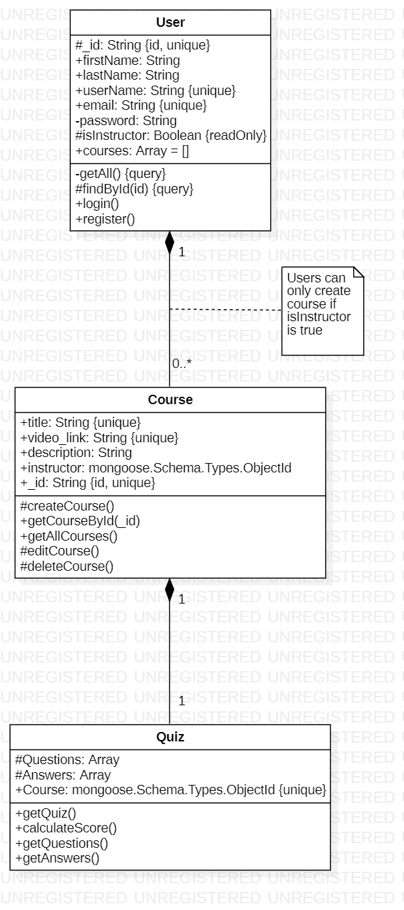

# eLearning-Platform-Backend

## About 
This is the semester project for CS4398, this project is create a web app similar to udemy or coursera.
In this repository all of the server side code is stored here. This is a node.js server with express as the middleware. The database being used is Mongodb. The frontend of this code can be found in the repository `eLearning-Platform-frontend` 

## Class Diagram 

## Cloning Instructions
1. Fork the repository
2. Open in terminal 
3. run `npm install`
4. run `npm run dev` to start the dev server

## Before running the server 
- Be sure to create a .env file
- in the `index.js` file there is a variable named `process.env.MONGO_CONNECT_KEY`
- This variable is pulled from the .env file 
- To intialize the variable create the .env file and add `MONGO_CONNECT_KEY=<yourkey>`
- I will have to make users on mongodb and allow for you to connect... reach out if needed. 
 